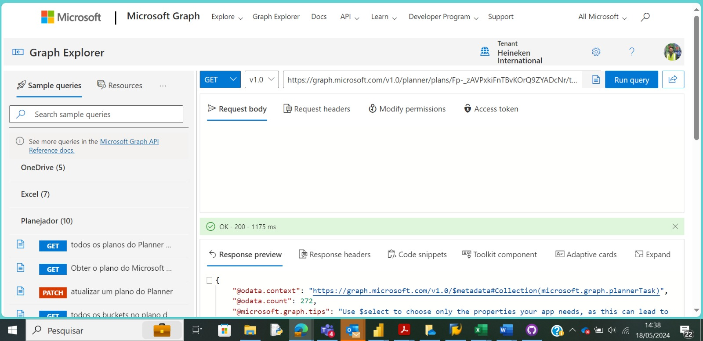
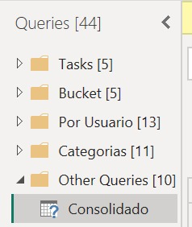

# Integração do Microsoft Planner no Power BI para Acompanhamento de Entregas

   

## Problem Statement

### Dashboard para Acompanhamento de Entregas Integrado com Microsoft Planner

Este dashboard ajuda a empresa a entender melhor as suas operações de entregas, integrando o Microsoft Planner ao Power BI através de uma API criada utilizando o Microsoft Graph. O objetivo é criar um dashboard que facilite a visualização das informações presentes no Planner e acompanhe as entregas de cada membro da equipe. Para realizar essa integração, foram seguidos os seguintes passos:

### Passos Seguidos

1. **Carregar dados no Power BI Desktop**: O dataset é obtido através da API criada no Microsoft Graph.
   - Conectar o Power BI ao banco de dados do Planner utilizando o conector de API web.

   

2. **Abrir o Power Query Editor**: No editor de consulta, na guia "Exibir", marcar as opções "distribuição de coluna", "qualidade da coluna" e "perfil da coluna" na seção de visualização de dados.

4. **Verificação de Erros**: Verificar a presença de erros ou valores vazios nas colunas relevantes.
   - Foi observado que a maioria das colunas não possui erros ou valores vazios, exceto a coluna "Arrival Delay".

5. **Cálculo do Curva S**: Para calcular a curva S alguns formulas foram desenvolvidas:

    
    STATUS = 
        
        Table.AddColumn(Source, "Status", each if [percentComplete] = 0 then "Não Iniciada" else if [percentComplete] = 50 then "Em andamento" else if [percentComplete] = 100 then "Concluída" else null)

     S Curve (EEM) - Total Complete Tasks Accumulated = 
        
         DIVIDE('consolidado'[S Curve (EEM) - sum cumulative complete tasks]; 'Consolidado'[S Curve - sum of all planner tasks accumulated];
BLANK())

     S Curve (EEM) - Total Planner Accumulated = 
        
        DIVIDE('Consolidado'[S Curve (EEM) - sum cumulative planned tasks]; 'Consolidado'[S Curve (EEM) - sum of all planned tasks accumulated];
BLANK())  

     S/A PLAN = 
        
       Table.AddColumn(#"Semana Real", "SA Plan", each Text.Combine({Text.From([Ano Plan], "pt-BR"), Text.From([Semana Plan], "pt-BR")}, "-"), type text)
   
     S/A REAL = 
        
        Table.AddColumn(#"SA Plan", "SA Real", each Text.Combine({Text.From([Ano Real], "pt-BR"), Text.From([Semana Real], "pt-BR")}, "-"), type text)
   
     TASKS ENCERRADAS = 
        
        Table.DuplicateColumn(#"Added Conditional Column1", "dueDateTime", "dueDateTime - Copy")   
   
     Calendar_suporte = 
        
        FILTER(
    DISTINCT(
        UNION(
            SELECTCOLUMNS('Consolidado';"SA";'Consolidado'[SA Plan]);
            SELECTCOLUMNS('Consolidado';"SA"; Consolidado[SA Real])
        )
    );
[SA] <> BLANK()
)

7. **Correlação de Queries**: As Queries foram integradas para atender as necessidades supracitadas:

   

   

9. **Representação das Avaliações**: Como os dados contêm várias avaliações, um novo visual foi adicionado usando as três elipses no painel de visualizações no modo de relatório.

10. **Filtros Visuais (Slicers)**: Adicionar filtros visuais para campos relevantes, como "Região de Entrega", "Tipo de Produto", "Tipo de Cliente" e "Método de Entrega".

11. **Visuais de Cartão**: Adicionar dois visuais de cartão ao canvas, um representando o atraso médio na partida em minutos e outro representando o atraso médio na chegada em minutos.
   - Usar o filtro de nível visual no painel de filtros para excluir valores nulos na consideração do cálculo da média.
   - Por padrão, valores em branco são ignorados ao calcular a média.

11. **Gráfico de Barras**: Adicionar um gráfico de barras à área de design do relatório representando o número de clientes satisfeitos e neutros/insatisfeitos.
    - Adicionar o campo "Gênero" ao bucket de Legendas, segregando assim o número de clientes por gênero.

12. **Visual de Avaliações**: Representar diferentes avaliações como:
    - Manuseio de bagagem
    - Serviços de check-in
    - Limpeza
    - Facilidade de reserva online
    - Comida e bebida
    - Entretenimento a bordo
    - Serviço a bordo
    - Serviço de Wi-Fi a bordo
    - Espaço para as pernas
    - Conforto do assento
    - Conveniência de horários de partida e chegada

    Alguns parâmetros podem ser 0, representando que não se aplicam a certos clientes. Esses valores são ignorados ao calcular a média das avaliações.

13. **Caixas de Texto**: No modo de relatório, sob a guia "Inserir", adicionar duas caixas de texto ao canvas, uma com o nome da empresa e outra com o slogan da empresa.

14. **Inserção de Imagens e Formas**: Inserir um retângulo usando a opção de formas do grupo de elementos e adicionar o logotipo da empresa ao design do relatório.

15. **Criação de Coluna Calculada**: Criar uma coluna calculada para agrupar clientes em várias faixas etárias usando a seguinte expressão DAX:

### Steps followed 

- Step 1 : Load data into Power BI Desktop, dataset is a csv file.
- Step 2 : Open power query editor & in view tab under Data preview section, check "column distribution", "column quality" & "column profile" options.
- Step 3 : Also since by default, profile will be opened only for 1000 rows so you need to select "column profiling based on entire dataset".
- Step 4 : It was observed that in none of the columns errors & empty values were present except column named "Arrival Delay".
- Step 5 : For calculating average delay time, null values were not taken into account as only less than 1% values are null in this column(i.e column named "Arrival Delay") 
- Step 6 : In the report view, under the view tab, theme was selected.
- Step 7 : Since the data contains various ratings, thus in order to represent ratings, a new visual was added using the three ellipses in the visualizations pane in report view. 
- Step 8 : Visual filters (Slicers) were added for four fields named "Class", "Customer Type", "Gate Location" & "Type of travel".
- Step 9 : Two card visuals were added to the canvas, one representing average departure delay in minutes & other representing average arrival delay in minutes.
           Using visual level filter from the filters pane, basic filtering was used & null values were unselected for consideration into average calculation.
           
           Although, by default, while calculating average, blank values are ignored.
- Step 10 : A bar chart was also added to the report design area representing the number of satisfied & neutral/unsatisfied customers. While creating this visual, field named "Gender" was also added to the Legends bucket, thus number of customers are also seggregated according the gender. 
- Step 11 : Ratings Visual was used to represent different ratings mentioned below,

  (a) Baggage Handling

  (b) Check-in Services
  
  (c) Cleanliness
  
  (d) Ease of online booking
  
  (e) Food & Drink
  
  (f) In-flight Entertainment

  (g) In-flight Service
  
  (h) In-flight wifi service
  
  (i) Leg Room service
  
  (j) On-board service
  
  (k) Online boarding
  
  (l) Seat comfort
  
  (m) Departure & arrival time convenience
  
In our dataset, Some parameters were assigned value 0, representing those parameters are not applicable for some customers.

All these values have been ignored while calculating average rating for each of the parameters mentioned above.

- Step 12 : In the report view, under the insert tab, two text boxes were added to the canvas, in one of them name of the airlines was mentioned & in the other one company's tagline was written.
- Step 13 : In the report view, under the insert tab, using shapes option from elements group a rectangle was inserted & similarly using image option company's logo was added to the report design area. 
- Step 14 : Calculated column was created in which, customers were grouped into various age groups.

for creating new column following DAX expression was written;
       
        Age Group = 
        
        if(airline_passenger_satisfaction[Age]<=25, "0-25 (25 included)",
        
        if(airline_passenger_satisfaction[Age]<=50, "25-50 (50 included)",
        
        if(airline_passenger_satisfaction[Age]<=75, "50-75 (75 included)",
        
        "75-100 (100 included)")))
        
Snap of new calculated column ,

        
- Step 15 : New measure was created to find total count of customers.

Following DAX expression was written for the same,
        
        Count of Customers = COUNT(airline_passenger_satisfaction[ID])
        
A card visual was used to represent count of customers.

        
 - Step 16 : New measure was created to find  % of customers,
 
 Following DAX expression was written to find % of customers,
 
         % Customers = (DIVIDE(airline_passenger_satisfaction[Count of Customers], 129880)*100)
 
 A card visual was used to represent this perecntage.
 
 Snap of % of customers who preferred business class
 
 

 
 - Step 17 : New measure was created to calculate total distance travelled by flights & a card visual was used to represent total distance.
 
 Following DAX expression was written to find total distance,
 
         Total Distance Travelled = SUM(airline_passenger_satisfaction[Flight Distance])
    
 A card visual was used to represent this total distance.
 
 
 
 
 - Step 18 : The report was then published to Power BI Service.
 
 

# Snapshot of Dashboard (Power BI Service)

 
 # Report Snapshot (Power BI DESKTOP)

 

# Insights

A single page report was created on Power BI Desktop & it was then published to Power BI Service.

Following inferences can be drawn from the dashboard;

### [1] Total Number of Customers = 129880

   Number of satisfied Customers (Male) = 28159 (21.68 %)

   Number of satisfied Customers (Female) = 28269 (21.76 %)

   Number of neutral/unsatisfied customers (Male) = 35822 (27.58 %)

   Number of neutral/unsatisfied customers (Female) = 37630 (28.97 %)

           thus, higher number of customers are neutral/unsatisfied.
           
### [2] Average Ratings

    a) Baggage Handling - 3.63/5
    b) Check-in Service - 3.31/5
    c) Cleanliness - 3.29/5
    d) Ease of online booking - 2.88/5
    e) Food & Drink - 3.21/5
    f) In-flight Entertainment - 3.36/5
    g) In-flight service - 3.64/5
    h) In-flight Wifi service - 2.81/5
    i) Leg room service - 3.37/5
    j) On-board service - 3.38/5
    k) Online boarding - 3.33/5
    l) Seat comfort - 3.44/5
    m) Departure & arrival convenience - 3.22/5
  
  while calculating average rating, null values have been ignored as they were not relevant for some customers. 
  

         thus, maximum customers travelled by Business class.
 
 ### Age Group
 
group.
 
         thus, maximum customers belong to '25-50' age group.
         
### Customer Type

        thus, more customers have travel type 'Business'.
# Airlines-Dashboard.md.txt
Exibindo # Airlines-Dashboard.md.txt…
