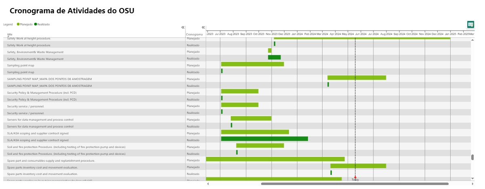

# Integração do Microsoft Planner no Power BI para Acompanhamento de Entregas

## Problem Statement

### Dashboard para Acompanhamento de Entregas Integrado com Microsoft Planner

Este dashboard ajuda a empresa a entender melhor as suas operações de entregas, integrando o Microsoft Planner ao Power BI através de uma API criada utilizando o Microsoft Graph. O objetivo é criar um dashboard que facilite a visualização das informações presentes no Planner e acompanhe as entregas de cada membro da equipe. Para realizar essa integração, foram seguidos os seguintes passos:

### Passos Seguidos

1. **Carregar dados no Power BI Desktop**: O dataset é obtido através da API criada no Microsoft Graph.
   - Conectar o Power BI ao banco de dados do Planner utilizando o conector de API web.

   

2. **Abrir o Power Query Editor**: No editor de consulta, na guia "Exibir", marcar as opções "distribuição de coluna", "qualidade da coluna" e "perfil da coluna" na seção de visualização de dados.

4. **Verificação de Erros**: Verificar a presença de erros ou valores vazios nas colunas relevantes.
   - Foi observado que a maioria das colunas não possui erros ou valores vazios, exceto a coluna "Arrival Delay".

5. **Colunas Condicionais**: Para calcular a curva S alguns formulas foram desenvolvidas:

    
    STATUS = 
        
        Table.AddColumn(Source, "Status", each if [percentComplete] = 0 then "Não Iniciada" else if [percentComplete] = 50 then "Em andamento" else if [percentComplete] = 100 then "Concluída" else null)

     S/A PLAN = 
        
       Table.AddColumn(#"Semana Real", "SA Plan", each Text.Combine({Text.From([Ano Plan], "pt-BR"), Text.From([Semana Plan], "pt-BR")}, "-"), type text)
   
     S/A REAL = 
        
        Table.AddColumn(#"SA Plan", "SA Real", each Text.Combine({Text.From([Ano Real], "pt-BR"), Text.From([Semana Real], "pt-BR")}, "-"), type text)
   
     TASKS ENCERRADAS = 
        
        Table.DuplicateColumn(#"Added Conditional Column1", "dueDateTime", "dueDateTime - Copy")   
   
     Calendar_suporte = 
        
        FILTER(
    DISTINCT(
        UNION(
            SELECTCOLUMNS('Consolidado';"SA";'Consolidado'[SA Plan]);
            SELECTCOLUMNS('Consolidado';"SA"; Consolidado[SA Real])
        )
    );
[SA] <> BLANK()
)

7. **Correlação de Queries**: As Queries foram integradas para atender as necessidades supracitadas, dessa forma posibilitamos a criação de visual que relacionacem as atividades aos usuários, data, bucktes do planner, áreas das atividades e ao status dela:

   

     

10. **Curva S**: Adicionar filtros visuais para campos relevantes, como "Região de Entrega", "Tipo de Produto", "Tipo de Cliente" e "Método de Entrega".

     S Curve (EEM) - sum cumulative complete tasksd = 
        
         CALCULATE([Total acumulado de SA Real]; FILTER(ALL('Calendar_suporte'[SA]); 'Calendar_suporte'[SA]<=MAX('Calendar_suporte'[SA])))

     S Curve (EEM) - sum cumulative planned tasks = 
        
         CALCULATE([Soma de quantidade por SA Plam]; FILTER(ALL('Calendar_suporte'[SA]); 'Calendar_suporte'[SA]<=MAX('Calendar_suporte'[SA]))) 

     S Curve (EEM) - Total Complete Tasks Accumulated = 
        
         DIVIDE('consolidado'[S Curve (EEM) - sum cumulative complete tasks]; 'Consolidado'[S Curve - sum of all planner tasks accumulated];
BLANK())

     S Curve (EEM) - Total Planner Accumulated = 
        
        DIVIDE('Consolidado'[S Curve (EEM) - sum cumulative planned tasks]; 'Consolidado'[S Curve (EEM) - sum of all planned tasks accumulated];
BLANK()) 

Resultado final:

   

   

11. **Visuais Gerais**: Foram criados os visuais de tasks realizadas, atrasadas e planejadas, além do ranking de execução e tasks atrasadas:

   

   

11. **CRONOGRAMA**: Esse foi um gráfico criado para acompanhamentos das tasks em andamento no dia atual (Today), porém serve para vizualizar as proximas ações bem como as que já foram executadas:

   

   

11. **FOLLOW UP**: Por fim um follow up do planner facilita a contextualização do arquivo

   

   

15. **Inserção de Imagens e Formas**: Inserir um retângulo usando a opção de formas do grupo de elementos e adicionar o logotipo da empresa ao design do relatório.
